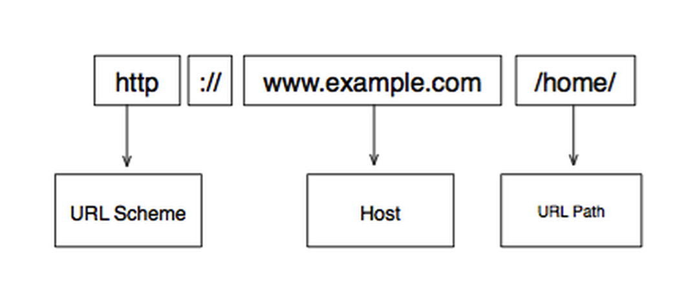
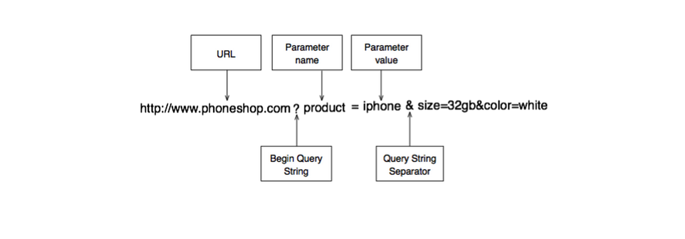

## Http协议

### 无状态的
当一个协议设计成每一个请求/响应周期与前一个都是互相独立的话，我们就说这个协议是无状态的。对于 HTTP 要知道的一点就是，无状态协议对于服务器资源和易用性的影响。HTTP 协议下，服务器不需要在各次请求之间保留状态信息。结果就是如果一次请求出了问题，系统不必做任何清理。以上两个原因让 HTTP 协议变的很灵活，但同时也变的很难构建有状态的应用。因为 HTTP 本质上是个无状态的互联网协议，这就意味着 web 开发人员在构建有状态应用的时候，不得不努力想办法来模拟 web 应用中的有状态体验。 举个例子，当你上 Facebook 的时候，你先登录，然后你看到了一个 Facebook 的网页。这就是一个完整的请求/响应周期。你点了一张照片 -- 另一个请求/响应周期 -- 但是在第二个动作之后你并没有退出登录。如果 HTTP 是无状态的，它是怎么维持状态并且知道你刚刚已经登录过了呢？事实上，如果 HTTP 是无状态的，Facebook 是怎么知道哪个请求是你发出的？它是怎么区分你和其他用户的？这些都是 web 开发人员和 web 开发框架耍的小诡计，让 web 应用看起来像是有状态的，不过这些小诡计不在本书的讨论范围内。你所要记住的就是，尽管你觉得这个应用是有状态的，但是在它背后，这个 web 应用是构建在 HTTP，一个无状态协议之上的。以上，就是为什么 web 如此灵活和去中心化，同时又特别难控制，也是为什么 web 的安全性难以保证，为什么在 web 上构建应用不是易事。

### URL
* 统一资源定位符 (Uniform Resource Locator) 或 URL
`http://www.example.com/home`   

	* `http`：通常被称为 URL 模式（ scheme ）。总是出现在冒号和两个斜杠之前，作用是告诉 web 客户端怎样去访问一个资源。在本例中，它告诉 web 客户端使用超文本传输协议也就是 HTTP 去发起一个请求。常见的 URL 模式还有`ftp`，`mailto`和`git`。
	* `www.example.com`：URL 的第二个部分，就是资源路径或主机 (host)。它告诉客户端，资源的确切位置。
	* `/home/`：URL 的第三个部分就是 URL 路径。它代表了客户端正在请求什么样的本地资源 (对于服务器来说)。

有时候，这个路径指向了一个主机上特定的资源。比如，www.example.com/home/index.html指向了 example.com 服务器上的一个 HTML 文件。

另外，URL 可以包含一个主机用来监听 HTTP 请求的端口号。一个http://localhost:3000/profile这样的 URL，通过 3000 端口去监听 HTTP 请求。web 客户端用来监听 HTTP 请求的默认端口号是 80，如果一个 URL 中没有指定其他的端口号，那就等价于写了80 除非指定了其他的端口号代替，不然端口号80会被默认用于正常的 HTTP 请求。

使用查询字符串向服务器传递附加信息是个很棒的方法，但是对于查询字符串的使用，以下是一些限制：    

*  查询字符串有最大长度。所以，如果你大量的数据需要传输，还是不要用查询字符串的好。
*  查询字符串中使用的键/值对儿是显示在 URL 上的。所以，不推荐用查询字符串传输敏感信息比如用户名或密码。
*  查询字符串中无法使用空格和特殊字符比如&。它们必须用 URL 编码代替，我们接下来会讨论这个。

### HTTP请求
* GET
	* `GET` 请求经常用于取得一个资源，而且大部分超链接都是 GET 请求。
	* 一个 `GET` 请求的响应可以是任何东西，但是如果响应是一个 HTML 并且里面引用了其他资源，你的浏览器会自动对这些资源发起请求，而一个纯粹的 HTTP 工具则不会。
	* 使用 `GET` 请求的时候在大小和安全性上有一些限制。

* POST

### 处理响应
* 状态码
	*  302 Redirect（重定向）
		*  浏览器会自动跳转到 Location 响应头部里指定的 URL
	* 404 Not Found（未找到）
	* 500 Internal Server Error（内部服务器错误）

	
### 有状态的 web 应用
* 会话 （ session ）
	* 在客户端（一般就是指浏览器）的帮助下，HTTP 的行为会让人觉得它会在客户端与服务器之间维护一个有状态的连接，尽管实际并没有。达到这种效果的一个办法就是， 服务器在发送响应数据给客户端的时候带一个唯一的令牌（英文叫 token，就是一串数）。随后不论何时客户端向服务器发起请求的时候都把这个令牌附加在后面，让服务器能够辨识这个客户端。在 web 开发领域我们把这个来回传递的令牌叫做会话标识符（ session identifier ）。
	* 这种在客户端与服务器之间传递会话 id的机制，能让服务器创建一种各次请求之间的持续连接状态。Web 开发人员利用这种人造的状态，来构建复杂的应用程序。即使这样，每一个请求严格上来说还是无状态的，各次请求之间并不知道彼此的存在。
	* 这就意味着服务器必须非常辛勤的工作，来模拟这个有状态的用户体验。每一个请求都会有一个独立的响应，哪怕这次的响应跟前一个响应没有任何区别。举个例子，如果你登录到 Facebook 上，服务器会给你一个响应，生成你看到的主页。这个响应是一个十分复杂的 HTML 页面。Facebook 的服务器会把页面上所有照片和留言的赞和评论都组合起来，然后显示在你的时间线上。生成这样一个页面的成本非常高。现在，如果你点了某个照片下面的” 赞 “链接，理论上，Facebook 会重新生成整个页面，它会把你赞过的照片的被赞数加 1，然后把整个 HTML 作为响应返回给你，尽管除了这个赞数以外大部分内容都没有改变。 庆幸的是，实际中 Facebook 使用 Ajax 代替了全页面刷新。不然的话，刷新一个页面会花费很长时间。

### Cookies
* cookie 就是在一个请求/响应周期内，服务器发送给客户端（通常就是浏览器），并存储在客户端的一段数据。
* 会话数据是由服务器生成并存储在服务器上，会话 id 以 cookie 的形式发送到客户端上。我们还看到了 web 应用程序如何充分利用这些来模拟在 web 上的有状态体验。

### AJAX
* AJAX 是”异步 javascript 和 XML “ 的简称（ Asynchronous JavaScript and XML 
* AJAX 请求的方法跟处理普通请求也是一样的。唯一不同就是，不是通过浏览器刷新来处理响应，而通常由客户端的一些 javascript 代码来处理。

### 安全的 HTTP（HTTPS）
* HTTPS 通过一个叫做 TLS 的加密协议来加密消息。在 TLS 开发完成前，早期 HTTPS 使用 SSL （ Secure Sockets Layer ）。

* 同源策略（ Same-origin policy ）
	* 同源策略是一个重要的概念，它允许来自同一站点的资源进行互相访问而不受限制，但是会阻止其他不同站点对文档/资源的访问。

* 会话劫持（ Session Hijacking ）

* 跨站脚本攻击 (XSS)

> 问题 post相对get似乎有很多优点，但为什么大部分请求还是用get？	

1. 参考[知乎的回答](http://www.zhihu.com/question/31640769/noti-answers?group_id=597747583268106240)

> get和post的区别

	关于技术上的问题可以看 RFC，楼上都说的很好了。说一些个人的看法，非技术层面上的，一个 API 何时用 GET、POST 甚至 PUT 请求。

	首先引入一个副作用的概念，副作用指当你发送完一个请求以后，网站上的资源状态没有发生修改，即认为这个请求是无副作用的。比如注册用户这个请求是有副作用的，获取用户详情可以认为是无副作用的。

	再引入一个幂等性的概念，幂等是说，一个请求原封不动的发送N次和M次（N不等于M，N和M都大于1）服务器上资源的状态最终是一致的。比如发贴是非幂等的，重放10次发贴请求会创建10个帖子。但修改帖子内容是幂等的，一个修改请求重放无论多少次，帖子最终状态都是一致的。

	唠叨了这么多，回过头来，何时用 PUT POST GET DELETE：

	GET：无副作用，幂等
	PUT：副作用，幂等
	POST：副作用，非幂等
	DELETE：副作用，幂等

	这么看的话，DELETE 和 PUT 请求好像毫无区别。为了进一步区分这些请求方式的应用场景，我们再引入一个技术特性，request body，就是大家广为流传的 "POST 请求传输数据量比较大“ 这一说法的来源。POST/PUT 请求可以通过传递 request body 来发送大量的数据，而 GET/DELETE 不能。

	所以上面的表格需要再加一项：

	GET：无副作用，幂等，不可带 Request Body
	PUT：副作用，幂等，可以带 Request Body
	POST：副作用，非幂等，可以带 Request Body
	DELETE：副作用，幂等，不可带 Request Body

最后，以上所有内容都来自于团队的工作经验，团队一开始参考过 restful 那篇论文以及 RFC，，有可能有些地方说的比较山寨，欢迎考据党考据下 RFC 来反对我。 

[HTTP下午茶](http://happypeter.github.io/tealeaf-http/#chinese)   强烈推荐    
[socket与http的区别](http://blog.csdn.net/zeng622peng/article/details/5546384)

